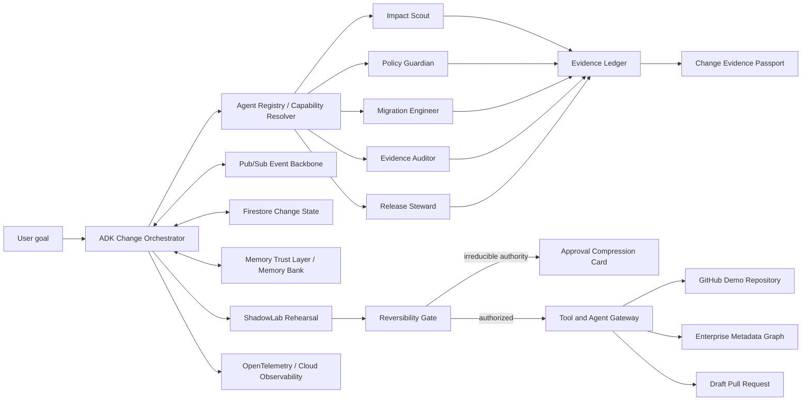

# ChangeMesh

> **Rehearse every critical change. Trust only proven agents. Execute with evidence.**

**ChangeMesh** is a policy-governed agent fleet that safely rehearses and executes high-risk enterprise architecture changes. It treats an enterprise change as a long-lived distributed transaction, not a chat session. Using the Google Agent Development Kit and Gemini, it discovers dependencies, rehearses migrations in a shadow environment, and compresses weeks of manual coordination into a single, tamper-evident Change Evidence Passport.

## Current status

> [!IMPORTANT]
> **Pre-implementation / competition build.**
> This repository currently contains the project charter, architecture constraints, governance system, and execution plan. Features must remain labeled `PLANNED`, `IN_PROGRESS`, `PASS`, `FAIL`, `NOT_RUN`, `SIMULATED`, `BLOCKED`, or `QUARANTINED` according to real evidence. A planned feature must never be presented as implemented.

## Competition target

- **Hackathon:** All Things Agentic Hackathon
- **Primary category:** Fortified Enterprise Fleet (See [`docs/CATEGORY_MAPPING.md`](docs/CATEGORY_MAPPING.md) for concrete architectural mapping)
- **Required model path:** Gemini 3.5 or newer through Vertex AI or the Gemini API
- **Primary agent framework:** Google Agent Development Kit (ADK)
- **Required cloud proof:** Google Cloud deployment and runtime evidence
- **Planned core services:** Cloud Run, Firestore, Pub/Sub
- **Target enterprise services:** Agent Runtime, Memory Bank, Agent Registry, Agent Identity, Agent Gateway, Model Armor, Agent Observability (Access Verified)

## The problem

A change that looks small in one system can cross source code, database schemas, data pipelines, dashboards, APIs, security policies, ownership boundaries, and release processes.

For example:

> Rename `customer_id` to `account_id` across the billing platform.

A conventional coding agent can change files. It usually cannot prove that it:

- found every downstream dependency;
- preserved backward compatibility;
- recovered from partial failure;
- used only authorized tools and data;
- resumed safely after days or weeks;
- distinguished real evidence from model confidence;
- escalated only the irreducible human decision;
- left a trustworthy handoff for the next agent or team.

## Product thesis

ChangeMesh treats an enterprise change as a **long-lived distributed transaction**, not a chat session. *(See [Product Brief](docs/PRODUCT_BRIEF.md) for full buyer, operator, and wedge definitions).*

Every change moves through eight explicit stages:

1. **Discover** — find relevant agents, tools, repositories, owners, and dependencies.
2. **Qualify** — verify the exact agent revision through a Capability Passport.
3. **Rehearse** — run policy-defined failure, attack, recovery, and stale-context scenarios in ShadowLab.
4. **Ground** — load only trusted, scoped, non-expired institutional memory.
5. **Authorize** — assign the smallest safe autonomy envelope through the Reversibility Gate.
6. **Execute** — perform asynchronous work through idempotent, recoverable steps.
7. **Prove** — collect deterministic evidence, traces, approvals, blocked actions, and `NOT_RUN` states.
8. **Certify** — seal the result in a Change Evidence Passport.

## Autonomous by default

ChangeMesh is designed as **human-on-the-loop**, not approval-heavy human-in-the-loop software.

The fleet should autonomously perform reversible and policy-approved work such as dependency analysis, planning, branch creation, migration and rollback artifact generation, tests, rehearsal, retry, draft PR creation, evidence collection, and handoff preparation.

Human attention is reserved for actions where organizational authority is required, such as irreversible production mutation, sensitive-data movement, privilege expansion, protected-branch merge, or production deployment.

### Approval Compression

Instead of many meetings, messages, and repeated explanations, ChangeMesh produces one bounded decision card containing:

- what has already been completed;
- which evidence passed or failed;
- what remains uncertain;
- the smallest requested authority;
- the recommended safe decision;
- the effect of approval or rejection.

*(See [Outcome Contract](docs/OUTCOME_CONTRACT.md) for strict metrics on how Approval Compression reduces human touches).*

## Core innovations

### ShadowLab — Change Rehearsal Twin

Before a critical real action, ChangeMesh rehearses the workflow against controlled tools and synthetic enterprise context.

Initial scenarios:

- normal migration;
- GitHub/API `503` recovery;
- partial migration interruption;
- stale approval detection;
- indirect prompt injection;
- missing rollback proof;
- agent restart and resume;
- downstream client compatibility failure.

A failed required rehearsal denies real execution authorization until the workflow is corrected and re-evaluated.

### Capability Passport

Agent discovery is not treated as trust. Each exact agent revision receives a passport recording declared capabilities, scenario results, authorized data/action classes, evidence hashes, validity, and revocation.

The orchestrator must route a task to a proven revision, not merely to an agent that claims a matching skill.

### Memory Trust Layer

Long-term memory is typed and governed. Initial memory classes:

- `OBSERVED_FACT`
- `HUMAN_DECISION`
- `AGENT_INFERENCE`
- `ASSUMPTION`
- `POLICY`
- `FAILED_APPROACH`
- `UNVERIFIED_EXTERNAL_INPUT`

Decision-relevant memory must carry source, scope, timestamp, validity, sensitivity, and evidence linkage. Stale, contradictory, untrusted, or injection-suspected memories are quarantined rather than silently reused.

### Reversibility Gate

Autonomy is determined by impact and reversibility, not by one global permission switch.

Initial decision classes:

- `AUTO_EXECUTE`
- `AUTO_EXECUTE_AND_NOTIFY`
- `REHEARSE_THEN_EXECUTE`
- `HUMAN_AUTHORITY_REQUIRED`
- `BLOCKED`

### Change Evidence Passport

The final passport binds mission, agent/tool identities, delegation and event chain, trusted context hashes, changed-file manifest, tests, rehearsals, blocked and `NOT_RUN` actions, authority decisions, semantic evaluation, and final integrity hash.

## Planned agent fleet

| Agent | Primary responsibility | Default authority |
|---|---|---|
| **Change Orchestrator** | Goal interpretation, dynamic routing, saga state, recovery | Coordinate; no unrestricted production mutation |
| **Impact Scout** | Repository, dependency, lineage, ownership, and conflict analysis | Read-only |
| **Policy Guardian** | Privacy, prompt injection, identity, tool and data policy evaluation | Block or constrain; no implementation writes |
| **Migration Engineer** | Safe expand–migrate–contract artifacts and tests | Write only to scoped branch/worktree |
| **Evidence Auditor** | Independent mission–change–test alignment review | Read-only; cannot rewrite deterministic facts |
| **Release Steward** | Draft PR, decision packet, passport, and handoff | Reversible release preparation only |

## Reference demo

The initial end-to-end scenario is a synthetic billing-platform change:

> Rename `customer_id` to `account_id` without breaking downstream clients.

Expected demonstration:

1. User provides one goal.
2. ChangeMesh discovers and qualifies required agent revisions.
3. Agents work asynchronously across repository and metadata context.
4. A direct destructive rename is blocked.
5. ShadowLab exposes a rollback or compatibility gap.
6. The fleet automatically changes to an expand–migrate–contract strategy.
7. Tests, migration artifacts, rollback proof, and a draft PR are created.
8. A new session resumes from trusted memory.
9. One compressed authority decision is requested only for the irreversible boundary.
10. A Change Evidence Passport and Google Cloud traces are shown.

## Target architecture

## Google-native implementation policy

The competition runtime must not be presented as an Antigravity desktop automation.

- **Antigravity:** development environment and governed coding assistant.
- **Google ADK:** product multi-agent runtime and orchestration.
- **Gemini 3.5+ via Vertex AI/Gemini API:** runtime reasoning.
- **Google Cloud:** actual deployed backend and evidence source.

Where a target enterprise service is unavailable because of preview access, account, quota, or region:

1. record the real limitation;
2. keep the state `NOT_RUN`;
3. use a clearly labeled local deterministic adapter only for development;
4. never present the adapter as proof of the unavailable managed service.

## Repository governance

Before changing code, every development agent must read:

1. `AGENTS.md`
2. `AGENT_OS_RULES.md`
3. `plans/CHANGEMESH_MASTER_EXECUTION_PLAN.md`
4. `AGENT_MEMORY_AND_LESSONS.md`
5. `AGENT_ARCHITECTURE_AND_PATTERNS.md`
6. `AGENT_ENVIRONMENT_AND_API.md`
7. `AGENT_USER_PREFERENCES.md`
8. `docs/HANDOFF.md`

The project charter is already agreed. **No Phase-0 interview is required.** Questions are permitted only when a genuine blocking product decision cannot be derived from the frozen charter, repository evidence, policies, or memory.

## Evidence boundary

| State | Meaning |
|---|---|
| `PASS` | A named check or action actually completed successfully |
| `WARN` | Evidence exists but requires attention |
| `FAIL` | A named executed check failed |
| `NOT_RUN` | The check or integration was not executed |
| `SIMULATED` | The result came from an explicitly labeled simulation |
| `BLOCKED` | Policy prevented execution; the action remains `NOT_RUN` |
| `QUARANTINED` | Context or memory is excluded from decisions pending review |

Model opinions can evaluate semantic sufficiency. They cannot rewrite locked execution facts.

## Development roadmap

The binding, living roadmap is:

- [`plans/CHANGEMESH_MASTER_EXECUTION_PLAN.md`](plans/CHANGEMESH_MASTER_EXECUTION_PLAN.md)

No implementation task is complete until the plan, architecture, memory, environment notes, README, handoff, and affected judge-facing documents are synchronized.

## Setup

Setup commands are intentionally not published yet.

They will be added only after the dependency, local environment, and deployment phases are implemented and reproduced on a clean checkout. Until then, any claim that the repository is runnable must remain `NOT_RUN`.

## Product direction beyond the hackathon

The initial product wedge is **high-risk schema and API change coordination**. A credible post-competition path can expand into regulated release assurance, data-platform change certification, cross-repository migration orchestration, agent capability certification, institutional memory governance, and enterprise-agent fleet control.

The product should remain focused on proof-carrying change rather than becoming a generic chatbot, generic workflow builder, or generic agent marketplace. *(See [Non-Goals and Red Lines](docs/NON_GOALS.md) for strict boundaries).*

## License

License decision is pending. It must be resolved before public release and recorded in `docs/DECISION_LOG.md`.
