# ChangeMesh Architecture

> **Status:** `P-04 DONE; P-05.01, P-05.02, P-05.03, P-05.04 IMPLEMENTED`
> **Produced by:** P-04.01, P-04.02, P-04.03, P-04.04, P-04.05, P-05.01, P-05.02, P-05.03, and P-05.04
> **Date:** 2026-08-13
> **Implementation state:** Architecture design is complete (P-04). Five foundational domain contracts (ChangeRequest, SuccessCriterion, AgentDescriptor, ToolDescriptor, DataClass) are implemented (P-05.01). The lifecycle state machine is implemented (P-05.02). Evidence contracts are implemented (P-05.03). Core innovation contracts (MemoryRecord, CapabilityPassport, RehearsalScenario, RehearsalResult, AutonomyDecision, ApprovalCompressionCard) are implemented as schema-only (P-05.04). Runtime services — Memory Trust Layer (P-11), Agent Registry / Capability Passport runtime (P-12), ShadowLab (P-13), Approval Compression runtime (P-14), Evidence Ledger — remain `PLANNED`. Remaining domain contracts (event envelope), agents, cloud services, and UI remain `PLANNED`.

This document defines the component boundaries, dependency directions, and canonical planned package map for ChangeMesh. It is the binding architecture contract for subsequent implementation phases.

> [!IMPORTANT]
> This is a **planned component dependency architecture**, not a final implemented architecture.
> Domain schemas are defined in P-05. Implementation stack is frozen in P-06. Runtime implementation begins in P-07+.
> Do not treat this document as proof of implemented features.

## 1. Architecture Principles

1. **Inward dependency direction:** Provider-specific outer layers (Google SDK, ADK, Firestore, PubSub, GitHub, UI) depend inward on ChangeMesh domain contracts. Domain contracts never depend outward on providers.
2. **Google-native runtime:** The product runtime uses Google ADK + Gemini + Google Cloud. Provider independence means domain contracts do not carry Google SDK types — it does not mean removing Google from the runtime.
3. **One canonical owner per responsibility:** Each architectural concern has exactly one canonical component. No duplicate owners.
4. **Deterministic facts before model judgment:** Deterministic code owns execution facts. Gemini provides semantic evaluation but cannot rewrite those facts.
5. **Component vs Authority distinction:** Authority is conceptually separated into deterministic code, Gemini judgment, organizational policy, and human decision. Executors cannot self-authorize.
6. **Zero-Trust and Credential Isolation:** Trust domains are strictly bound. Credentials exist only at adapters and never propagate inward. External content is untrusted data. Trust boundary crossing never escalates authority.
7. **Adapters are replaceable:** Changing a provider adapter (e.g., GitHub → synthetic, Firestore → test double) must not require changes to domain contracts.
8. **Fixtures are outer-layer test adapters:** Production runtime never imports fixture/test code. Fixtures depend inward on contracts.
9. **Fail closed for unknown:** Unknown capability, expired memory, missing evidence, invalid schema, or uncertain irreversible target must not become authorization.

## 2. Component Architecture Diagram

The following diagram shows the planned component architecture with explicit dependency directions.

**Arrow semantics:** `A --> B` means **"A depends on B"** (A uses/calls/imports B). Arrows point from consumer to dependency.

```mermaid
graph TB
    subgraph ENTRY["Entrypoint / Presentation Layer"]
        direction LR
        DASHBOARD["Judge/Operator Dashboard<br/>(web/)"]
        API["API Entrypoint<br/>(api/)"]
    end

    subgraph ORCHESTRATION["Orchestration / Agent Runtime Layer"]
        direction LR
        ORCH["Change Orchestrator<br/>(Google ADK)<br/>src/agents/change_orchestrator.py"]
        IMPACT["Impact Scout<br/>src/git/impact_scout.py"]
        POLICY_G["Policy Guardian<br/>src/agents/policy_guardian.py"]
        MIG_ENG["Migration Engineer<br/>src/agents/migration_engineer.py"]
        EVID_AUD["Evidence Auditor<br/>src/agents/evidence_auditor.py"]
        REL_STEW["Release Steward<br/>src/agents/release_steward.py"]
    end

    subgraph DOMAIN["ChangeMesh Domain Contracts / Core"]
        direction LR
        CONTRACTS["Domain Contracts<br/>Schemas, Enums, Ports<br/>(domain/contracts/)"]
        APPROVAL["Approval Compression<br/>src/auth/approval_compression.py"]
        SHADOW["ShadowLab Auth<br/>src/policy/shadowlab_auth.py"]
        GEMINI_SO["Gemini Structured Output<br/>src/core/gemini_structured_output.py"]
    end

    subgraph EVIDENCE["Evidence / Persistence / Memory Layer"]
        direction LR
        EVID_REC["Evidence Record / Ledger<br/>src/evidence/evidence_record.py"]
        TIMELINE["PubSub Timeline<br/>src/evidence/pubsub_timeline.py"]
        PASSPORT["Change Passport<br/>src/evidence/change_passport.py"]
        CLAIM["Claim Audit<br/>src/audit/claim_audit.py"]
        SAGA["Firestore Saga<br/>src/orchestrator/firestore_saga.py"]
        MEMORY["Memory Trust Layer<br/>src/memory/trust_layer.py"]
    end

    subgraph ADAPTERS["External Adapters / Provider Layer"]
        direction LR
        GH_ADAPT["GitHub Adapter<br/>(integrations/github/)"]
        META_ADAPT["Metadata Graph Adapter<br/>(integrations/metadata/)"]
        GCP_ADAPT["Google Cloud Services<br/>(Firestore, PubSub, Vertex AI)"]
        EXT_TOOL["External Tool Boundary<br/>src/connectors/external_tool_boundary.py"]
    end

    subgraph FIXTURES["Fixtures / Test Doubles"]
        direction LR
        TEST_DOUBLES["Scenario Fixtures<br/>Tool Doubles<br/>Synthetic Enterprise Data"]
    end

    %% Entrypoint depends inward
    DASHBOARD --> CONTRACTS
    DASHBOARD --> EVID_REC
    API --> ORCH

    %% Orchestration depends on domain contracts
    ORCH --> CONTRACTS
    ORCH --> SAGA
    ORCH --> APPROVAL
    ORCH --> TIMELINE
    IMPACT --> CONTRACTS
    POLICY_G --> CONTRACTS
    POLICY_G --> SHADOW
    MIG_ENG --> CONTRACTS
    EVID_AUD --> CONTRACTS
    EVID_AUD --> EVID_REC
    REL_STEW --> CONTRACTS
    REL_STEW --> PASSPORT

    %% Evidence/persistence depends on domain contracts
    EVID_REC --> CONTRACTS
    TIMELINE --> CONTRACTS
    PASSPORT --> CONTRACTS
    CLAIM --> CONTRACTS
    SAGA --> CONTRACTS
    MEMORY --> CONTRACTS

    %% Adapters depend inward on contracts (never the reverse)
    GH_ADAPT --> CONTRACTS
    META_ADAPT --> CONTRACTS
    GCP_ADAPT --> CONTRACTS
    EXT_TOOL --> CONTRACTS

    %% Fixtures depend inward on contracts (never imported by production)
    TEST_DOUBLES --> CONTRACTS

    %% Domain contracts have NO outward arrows to adapters, providers, or fixtures
```



### Diagram Legend

| Symbol | Meaning |
|---|---|
| `A --> B` | A depends on (imports/calls/uses) B |
| Subgraph boundary | Logical layer grouping |
| `ENTRY` | Presentation / entrypoint layer — outermost |
| `ORCHESTRATION` | Agent runtime / application layer |
| `DOMAIN` | Provider-neutral domain contracts and core |
| `EVIDENCE` | Deterministic evidence, persistence, and memory |
| `ADAPTERS` | Provider-specific external integrations |
| `FIXTURES` | Test doubles and synthetic data — never imported by production |

**Key visual invariant:** All arrows from outer layers point inward toward `DOMAIN/CONTRACTS`. No arrow from `CONTRACTS` points outward to `ADAPTERS`, `FIXTURES`, or provider-specific types.

## 3. Canonical Planned Package Map

Every package listed below is `PLANNED`. No implementation exists yet.

| Logical Module | Planned Target Path | Responsibility | Dependency Direction | Allowed Dependencies | Forbidden Dependencies | Provider Status |
|---|---|---|---|---|---|---|
| **Domain Contracts** | `domain/contracts/` | Versioned schemas, enums, ports/interfaces, domain types | Core (depended upon by all) | Standard library primitives, other domain contracts | Google SDK, ADK, Firestore, PubSub, GitHub, UI, fixtures | Provider-neutral |
| **Change Orchestrator** | `src/agents/change_orchestrator.py` | ADK routing, saga coordination, recovery, multi-agent orchestration | Inward (depends on domain contracts, saga) | Domain contracts, Firestore Saga, Approval Compression, PubSub Timeline | Direct Firestore/PubSub client calls bypassing ports | Provider-specific (ADK) |
| **Firestore Saga** | `src/orchestrator/firestore_saga.py` | Durable workflow state persistence semantics | Inward (depends on domain contracts) | Domain contracts, Firestore adapter port | Direct Firestore SDK in core, UI, fixtures, GitHub SDK | Provider-neutral core + Firestore persistence adapter |
| **Impact Scout** | `src/git/impact_scout.py` | Read-only blast-radius, repository overlap, parallel-change conflict detection (CS-BLAST-001 + GL-CONFLICT-001 unified) | Inward (depends on domain contracts) | Domain contracts, repository adapter port | Direct GitHub/GitLab SDK in core, UI | Provider-neutral core + repository adapter |
| **Policy Guardian** | `src/agents/policy_guardian.py` | Deterministic and model-assisted policy checks, safety pre-checks (ZK-PRIV-001) | Inward (depends on domain contracts) | Domain contracts, ShadowLab Auth | Direct model SDK calls, UI | Provider-neutral core with provider-specific model adapter |
| **Migration Engineer** | `src/agents/migration_engineer.py` | Scoped artifact generation and migration boundaries (CS-MIG-001) | Inward (depends on domain contracts) | Domain contracts | Direct external writes, UI | Provider-neutral |
| **Evidence Record / Ledger** | `src/evidence/evidence_record.py` | Canonical deterministic fact and evidence authority (CCT-EVID-001) | Inward (depends on domain contracts) | Domain contracts | Model SDK, UI, fixtures | Provider-neutral |
| **Evidence Auditor** | `src/agents/evidence_auditor.py` | Independent semantic sufficiency review (CCT-SEM-001). NOT the owner of CCT-EVID-001 | Inward (depends on domain contracts, Evidence Record) | Domain contracts, Evidence Record (read) | Direct model fact rewrite, UI | Provider-neutral core with provider-specific model adapter |
| **Release Steward** | `src/agents/release_steward.py` | Reversible handoff, enforced pipeline writebacks (CS-WRITE-001). Consumes judge format from `docs/JUDGING_MAP.md` | Inward (depends on domain contracts, Change Passport) | Domain contracts, Change Passport, repository adapter port | Direct GitHub API calls bypassing adapter | Provider-neutral core with provider-specific adapter |
| **PubSub Timeline** | `src/evidence/pubsub_timeline.py` | Chronological execution and causal ordering (CCT-FLIGHT-001) | Inward (depends on domain contracts) | Domain contracts, event port/adapter | Direct PubSub SDK in core | Provider-neutral core + PubSub transport adapter |
| **Change Passport** | `src/evidence/change_passport.py` | Immutable passporting context (CS-PASS-001) | Inward (depends on domain contracts) | Domain contracts, Evidence Record | UI, fixtures | Provider-neutral |
| **Approval Compression** | `src/auth/approval_compression.py` | Autonomous vs escalation boundaries (UIPATH-AUTH-001) | Inward (depends on domain contracts) | Domain contracts | Direct model SDK, UI | Provider-neutral |
| **ShadowLab Auth** | `src/policy/shadowlab_auth.py` | Preflight validation and destructive action boundaries (CCT-PREFLIGHT-001) | Inward (depends on domain contracts) | Domain contracts | Direct external execution, UI | Provider-neutral |
| **Gemini Structured Output** | `src/core/gemini_structured_output.py` | Zero trust deserialization and contract validation (ZK-VALID-001) | Inward (depends on domain contracts) | Domain contracts | Fixture data, UI | Provider-neutral (validates output regardless of model) |
| **Claim Audit** | `src/audit/claim_audit.py` | Hard proof of claims and cross-document parity (ZK-CLAIM-001) | Inward (depends on domain contracts) | Domain contracts | UI, fixtures | Provider-neutral |
| **Memory Trust Layer** | `src/memory/trust_layer.py` | Trusted cross-session memory with provenance, TTL, quarantine | Inward (depends on domain contracts) | Domain contracts, memory store port | Direct store SDK, UI | Provider-neutral core with provider-specific store adapter |
| **Shared Memory Bus** | `src/memory/shared_memory_bus.py` | Multi-agent memory exchange (QW-BUS-001) | Inward (depends on domain contracts, Memory Trust Layer) | Domain contracts, Memory Trust Layer | Direct provider SDK, unrestricted mutable state | Provider-neutral |
| **External Tool Boundary** | `src/connectors/external_tool_boundary.py` | Connector honesty — unavailable results remain explicit (GL-HONEST-001) | Inward (depends on domain contracts) | Domain contracts | Fabricated API responses | Provider-neutral |
| **GitHub Adapter** | `integrations/github/` | Bounded GitHub adapter for repository operations | Outward (depends on domain contracts + GitHub SDK) | Domain contracts, GitHub SDK | Core domain types carrying GitHub-specific fields | Provider-specific |
| **Metadata Graph Adapter** | `integrations/metadata/` | Synthetic graph and optional external metadata adapter | Outward (depends on domain contracts) | Domain contracts | Hard external coupling required for core function | Provider-specific |
| **Observability** | `observability/` | Trace correlation, redaction, OpenTelemetry integration | Outward (depends on domain contracts) | Domain contracts, OpenTelemetry SDK | Core domain types carrying telemetry-specific fields | Provider-specific |
| **Web / Dashboard** | `web/` | Judge/operator dashboard | Outward (depends on domain contracts, Evidence Record) | Domain contracts, Evidence Record (read), application query interfaces | Durable workflow state, policy authority, evidence facts ownership | Provider-specific (UI framework) |
| **Capability Module** | `capability/` | Passport generation, validation, expiry, revocation | Inward (depends on domain contracts) | Domain contracts | UI, fixtures | Provider-neutral |
| **ShadowLab Scenarios** | `shadowlab/` | Scenario definitions, tool doubles, fault injection, results | Outward (depends on domain contracts) | Domain contracts | Production runtime import | Provider-neutral |
| **Events Module** | `events/` | PubSub envelope, replay, dead-letter handling | Inward (depends on domain contracts) | Domain contracts, event port/adapter | Direct PubSub SDK in core | Provider-neutral core + event transport adapter |
| **Fixtures / Test Doubles** | `tests/`, `fixtures/` | Synthetic enterprise data, scenario fixtures, tool doubles | Outward (depends on domain contracts) | Domain contracts, application interfaces | Production runtime must NEVER import | Test-only |

### Logical Module vs Physical Target Distinction

Some logical architecture modules map to multiple physical files or directories. The table below clarifies where a logical module name differs from the physical canonical target:

| Logical Module Name | Physical Canonical Target(s) | Reason |
|---|---|---|
| `orchestration` | `src/agents/change_orchestrator.py` (routing/coordination), `src/orchestrator/firestore_saga.py` (durable state) | Orchestration responsibility is split: ADK agent owns routing, Firestore Saga owns persistent state. Both serve the logical orchestration concept but have distinct canonical owners. |
| `state` | `src/orchestrator/firestore_saga.py` | "State" as a logical module is implemented through the Firestore Saga. There is no separate `state/` package. |
| `policy` | `src/agents/policy_guardian.py` (policy checks), `src/policy/shadowlab_auth.py` (destructive preflight) | Policy checking and destructive-target preflight are distinct responsibilities under the logical "policy" umbrella. |
| `evidence` | `src/evidence/evidence_record.py`, `src/evidence/pubsub_timeline.py`, `src/evidence/change_passport.py` | Evidence is a logical area with three distinct canonical components. |
| `integrations/github` and `git` | `src/git/impact_scout.py` (analysis), `integrations/github/` (adapter) | Impact Scout performs analysis logic; the GitHub adapter provides the provider-specific API binding. |

## 4. Explicit Dependency Matrix

| From (Consumer) | May Depend On | Must NOT Depend On |
|---|---|---|
| **Domain Contracts** (`domain/contracts/`) | Standard library primitives, other domain contracts | ADK, Gemini/Vertex clients, Firestore SDK, PubSub SDK, GitHub SDK, UI frameworks, fixtures, test code |
| **Agent / Application Layer** (`src/agents/*`, `src/auth/*`, `src/core/*`, `src/audit/*`) | Domain contracts, bounded application services/ports, approved runtime abstractions | Fixtures as production dependency, model output treated as deterministic facts, direct provider SDK calls bypassing ports |
| **Evidence / Persistence** (`src/evidence/*`, `src/orchestrator/*`, `src/memory/*`) | Domain contracts, provider port/adapter interfaces | UI, fixtures, direct external API calls bypassing adapters |
| **Infrastructure / Adapters** (`integrations/*`, provider-specific implementations) | Domain ports/contracts, provider SDK | Core domain types that carry provider-specific fields |
| **UI / Dashboard** (`web/`) | Application/query interfaces, domain contracts (read) | Durable workflow state ownership, policy authority, evidence fact mutation, external credential logic |
| **Observability** (`observability/`) | Domain contracts, OpenTelemetry SDK | Core domain logic carrying telemetry-specific types |
| **Capability** (`capability/`) | Domain contracts | UI, fixtures, direct provider SDK |
| **ShadowLab** (`shadowlab/`) | Domain contracts | Production runtime code (must be importable by tests, not by production) |
| **Fixtures / Test Doubles** (`tests/`, `fixtures/`) | Domain contracts, application interfaces | Production runtime must NEVER import fixture code |

### Provider-Independence Invariants

These invariants are binding for all subsequent implementation:

| Invariant | Status |
|---|---|
| Domain contracts → Google SDK | **FORBIDDEN** |
| Domain contracts → ADK | **FORBIDDEN** |
| Domain contracts → UI framework | **FORBIDDEN** |
| Domain contracts → Fixture/test code | **FORBIDDEN** |
| Domain contracts → Firestore SDK | **FORBIDDEN** |
| Domain contracts → PubSub SDK | **FORBIDDEN** |
| Domain contracts → GitHub SDK | **FORBIDDEN** |
| Domain contracts → Vertex/Gemini client | **FORBIDDEN** |
| Adapters → Domain contracts | **REQUIRED** (inward) |
| UI → Domain contracts | **REQUIRED** (inward) |
| Fixtures → Domain contracts | **REQUIRED** (inward) |
| Production code → Fixtures | **FORBIDDEN** |

## 5. Provider-Neutral Domain Boundary

### What is provider-neutral

The `domain/contracts/` boundary contains (P-05, partially implemented):
- Domain types: ChangeRequest, SuccessCriterion, AgentDescriptor, ToolDescriptor, DataClass (P-05.01 — **IMPLEMENTED**)
- Additional contracts: EvidenceRecord, lifecycle state machine (P-05.02 — **IMPLEMENTED**), CapabilityPassport, MemoryRecord, RehearsalScenario, RehearsalResult, AutonomyDecision, ApprovalCompressionCard (P-05.04 — **IMPLEMENTED** schema-only), event envelope (P-05.05 — PENDING), naming conventions (P-05.06 — PENDING)
- Versioned contract schemas
- Enums and state labels
- Port interfaces (abstract boundaries that adapters implement)

These artifacts define **what** ChangeMesh does without prescribing **how** the underlying infrastructure delivers it.

### What is NOT provider-neutral

The following are explicitly provider-specific and live outside the domain boundary:
- Google ADK agent composition and routing
- Firestore document operations
- PubSub message publishing/subscribing
- Vertex AI / Gemini API calls
- GitHub REST/GraphQL API calls
- Cloud Run deployment configuration
- UI framework (HTML/JS/CSS)

### Google-Native Runtime vs Provider-Independent Domain

ChangeMesh is a **Google-native product**. The competition runtime requires:
- Google ADK for agent orchestration
- Gemini 3.5+ via Vertex AI / Gemini API
- Google Cloud (Cloud Run, Firestore, PubSub)

Provider independence does **not** mean removing Google from the runtime. It means:
- Business/domain contracts do not import `google.cloud.firestore`, `google.cloud.pubsub`, `google.adk`, or `vertexai` types
- Domain logic is expressed through ports/interfaces
- Provider-specific adapters implement those ports
- Changing a provider adapter does not require changing domain contracts

This separation enables:
1. Testability: domain logic can be tested with in-memory doubles
2. Clarity: business rules are not entangled with infrastructure
3. Future portability: post-competition provider changes affect only adapter layer
4. Competition integrity: domain concepts are genuinely ChangeMesh concepts, not SDK wrapper names

## 6. Adapter Replaceability

### Conceptual Example: Repository Impact Port

```
┌──────────────────────────────────────────────────┐
│  Impact Scout (Application Layer)                │
│  Uses: RepositoryImpactPort                      │
│  Does not import: github, gitlab, or any SDK     │
└──────────────┬───────────────────────────────────┘
               │ depends on (inward)
               ▼
┌──────────────────────────────────────────────────┐
│  RepositoryImpactPort (Domain Contract)          │
│  Defines: get_affected_files(), get_owners(),    │
│           get_parallel_changes()                 │
│  Contains: NO provider SDK imports               │
└──────────────────────────────────────────────────┘
               ▲ implements (inward)
               │
    ┌──────────┴──────────┐
    │                     │
┌───┴──────────┐  ┌───────┴────────┐
│ GitHub       │  │ Synthetic      │
│ Adapter      │  │ Metadata       │
│ (provider)   │  │ Adapter (test) │
└──────────────┘  └────────────────┘
```

**Replaceability proof:** Changing from GitHub adapter to Synthetic Metadata adapter requires zero changes to Impact Scout or RepositoryImpactPort.

### Conceptual Example: Saga State Port

```
┌──────────────────────────────────────────────────┐
│  Firestore Saga (Application Layer)              │
│  Uses: SagaStatePort                             │
│  Does not import: firestore client               │
└──────────────┬───────────────────────────────────┘
               │ depends on (inward)
               ▼
┌──────────────────────────────────────────────────┐
│  SagaStatePort (Domain Contract)                 │
│  Defines: save_state(), load_state(),            │
│           transition(), compensate()             │
│  Contains: NO Firestore SDK imports              │
└──────────────────────────────────────────────────┘
               ▲ implements (inward)
               │
    ┌──────────┴──────────┐
    │                     │
┌───┴──────────┐  ┌───────┴────────┐
│ Firestore    │  │ In-Memory      │
│ Persistence  │  │ Test Double    │
│ Adapter      │  │ (test adapter) │
└──────────────┘  └────────────────┘
```

**Replaceability proof:** The Firestore persistence adapter implements SagaStatePort. An in-memory test double implements the same port. The Firestore Saga (application owner) code does not change when the backing store changes.

## 7. Mapping to P-04.00 Canonical Targets

All canonical target paths established during P-04.00 donor preflight are preserved without modification:

| Component ID | Canonical Target | P-04.00 Finding | P-04.01 Status |
|---|---|---|---|
| UAOS-GOV-001 | `AGENTS.md`, `CHANGEMESH_RULES.md`, `CHANGEMESH_PLAN_TEMPLATE.md`, `plans/CHANGEMESH_MASTER_EXECUTION_PLAN.md` | PASS | Preserved |
| UAOS-MEM-001 | `AGENT_MEMORY_AND_LESSONS.md`, `AGENT_ARCHITECTURE_AND_PATTERNS.md`, `AGENT_ENVIRONMENT_AND_API.md`, `AGENT_USER_PREFERENCES.md` | PASS | Preserved |
| UIPATH-STATE-001 | `src/orchestrator/firestore_saga.py` | PASS | Preserved |
| UIPATH-AUTH-001 | `src/auth/approval_compression.py` | PASS | Preserved |
| CCT-EVID-001 | `src/evidence/evidence_record.py` | PASS | Preserved |
| CCT-FLIGHT-001 | `src/evidence/pubsub_timeline.py` | PASS | Preserved |
| CCT-PREFLIGHT-001 | `src/policy/shadowlab_auth.py` | PASS | Preserved |
| CCT-SEM-001 | `src/agents/evidence_auditor.py` | PASS | Preserved |
| CCT-JUDGE-001 | `docs/JUDGING_MAP.md` | PASS | Preserved |
| ZK-PRIV-001 | `src/policy/policy_guardian.py` | PASS | Preserved |
| ZK-VALID-001 | `src/core/gemini_structured_output.py` | PASS | Preserved |
| ZK-CLAIM-001 | `src/audit/claim_audit.py` | PASS | Preserved |
| CS-BLAST-001 | `src/git/impact_scout.py` | PASS | Preserved |
| CS-MIG-001 | `src/agents/migration_engineer.py` | PASS | Preserved |
| CS-PASS-001 | `src/evidence/change_passport.py` | PASS | Preserved |
| CS-WRITE-001 | `src/agents/release_steward.py` | PASS | Preserved |
| QW-MEM-001 | `src/memory/trust_layer.py` | PASS | Preserved |
| QW-BUS-001 | `src/memory/shared_memory_bus.py` | PASS | Preserved |
| GL-CONFLICT-001 | `src/git/impact_scout.py` | PASS | Preserved |
| GL-HONEST-001 | `src/connectors/external_tool_boundary.py` | PASS | Preserved |

## 8. P-04.00 Canonical Ownership Parity

| Authority | Canonical Owner | Canonical Target | P-04.01 Preserved |
|---|---|---|---|
| Durable workflow state | Firestore Saga | `src/orchestrator/firestore_saga.py` | ✅ |
| Orchestration/routing/coordination | Google ADK Change Orchestrator | `src/agents/change_orchestrator.py` | ✅ |
| Deterministic evidence facts | Evidence Record / Ledger | `src/evidence/evidence_record.py` | ✅ |
| Chronological execution | PubSub Timeline | `src/evidence/pubsub_timeline.py` | ✅ |
| Policy/privacy | Policy Guardian | `src/agents/policy_guardian.py` | ✅ |
| Destructive target/preflight | ShadowLab Auth | `src/policy/shadowlab_auth.py` | ✅ |
| Trusted cross-session memory | Memory Trust Layer | `src/memory/trust_layer.py` | ✅ |
| External writes | Release Steward | `src/agents/release_steward.py` | ✅ |
| Blast radius (unified) | Impact Scout | `src/git/impact_scout.py` | ✅ |
| Semantic evidence sufficiency | Evidence Auditor (CCT-SEM-001 only) | `src/agents/evidence_auditor.py` | ✅ |
| Human authority compression | Approval Compression | `src/auth/approval_compression.py` | ✅ |

> [!IMPORTANT]
> The Change Orchestrator owns routing, saga coordination, and recovery.
> It does NOT own durable workflow state — that is exclusively owned by Firestore Saga.
> The Orchestrator coordinates; the Saga persists.

## 9. Authority Map (P-04.02)

ChangeMesh enforces strict separation of authority across four distinct lanes. See the canonical detailed map in [`AUTHORITY_MAP.md`](AUTHORITY_MAP.md).

1.  **Deterministic Code**: Owns objective execution facts (e.g., test PASS/FAIL, command outputs).
2.  **Gemini Semantic Judgment**: Owns advisory semantic evaluations (e.g., goal alignment).
3.  **Organizational Policy**: Owns normative rules and bounds.
4.  **Human Authority**: Owns irreversible business decisions inside explicitly permitted policy slots.

**Key Invariants:**
*   **Non-Overwrite**: Gemini and human operators cannot overwrite deterministic execution facts.
*   **No Self-Authorization**: Executors (e.g., Release Steward) cannot synthesize their own authorization.
*   **Fail Closed**: Duplicate or unknown authority configurations fail closed.

## 10. Trust Boundaries (P-04.03)

ChangeMesh enforces strict boundaries between trust domains (e.g., User, Agent, Subagent, Tool, GitHub, Metadata, Google Cloud, Public Judge UI). See the canonical detailed model in [`THREAT_MODEL.md`](THREAT_MODEL.md).

**Key Invariants:**
*   **Credential Isolation**: Credentials exist only at the adapter boundary. They must never propagate inward to model prompts, evidence, or public UI.
*   **External Content is Data**: Content from GitHub, tools, or metadata graphs is treated as untrusted data, never as system instructions.
*   **Public UI is Low-Trust**: The public judge surface receives only sanitized, credential-free data. It holds no reusable external-write authority.
*   **Authority Persists**: Crossing a trust boundary does not escalate authority (e.g., Gemini output cannot become deterministic execution truth).

## 11. Explicitly Deferred Architecture Work

The following architecture decisions are explicitly deferred to their designated phases:

| Deferred Topic | Designated Phase | Current Status |
|---|---|---|
| Authority map (deterministic code vs Gemini judgment vs org policy vs human authority) | P-04.02 | `DONE` |
| Trust boundaries (user, agent, subagent, tool, GitHub, metadata, GCP, public UI) | P-04.03 | `DONE` |
| Execution/evidence mode contract (fixture, simulation, recorded-cloud, live-write) | P-04.04 | `DONE` (see `docs/MODE_CONTRACT.md`) |
| Autonomy and friction review | P-04.05 | `DONE` (see `docs/AUTONOMY_REVIEW.md`) |
| Foundational domain schemas (ChangeRequest, SuccessCriterion, AgentDescriptor, ToolDescriptor, DataClass) | P-05.01 | `DONE` (see `docs/API_CONTRACTS.md`) |
| Lifecycle state machine | P-05.02 | `DONE` (see `domain/contracts/change_lifecycle.py`) |
| Core innovation contracts (MemoryRecord, CapabilityPassport, RehearsalScenario, RehearsalResult, AutonomyDecision, ApprovalCompressionCard) | P-05.04 | `DONE` (schema only; runtime in P-11–P-14) |
| Event envelope, naming/enum conventions | P-05.05–P-05.06 | `PENDING` |
| Implementation stack and dependency freeze (Python/Node version, package manager) | P-06 | `PENDING` |
| ADK agent skeleton implementation | P-07 | `PENDING` |
| Gemini integration and structured reasoning boundary | P-08 | `PENDING` |

## 12. Autonomy and Friction Invariants (P-04.05)

ChangeMesh is autonomous by default. Human interaction is exception-based, authority-bound, and minimal. The following invariants are binding for all subsequent implementation:

1.  **Exception-based human interaction:** Human approval exists only in explicitly defined `HUMAN_AUTHORITY` policy slots. All other work — discovery, qualification, rehearsal, retry, recovery, evidence collection, routing — proceeds autonomously.
2.  **Policy-determined autonomy:** Organizational policy (not executor convenience) determines whether an action is `AUTO_EXECUTE`, `AUTO_EXECUTE_AND_NOTIFY`, `REHEARSE_THEN_EXECUTE`, `HUMAN_AUTHORITY_REQUIRED`, or `BLOCKED`. `LIVE_WRITE` is not universally human-gated.
3.  **System-owned routing:** The Change Orchestrator and Capability Passport system own agent routing, multi-agent coordination, and delegation. Humans do not manually select agents or subagents for ordinary operation.
4.  **Bounded retry before escalation:** Deterministic retry, bounded alternate strategy, compensation/recovery, ShadowLab correction, and capability-qualified alternate agents are preferred before human escalation. Human escalation is not the default error handler.
5.  **No Phase-0 interview:** The product charter is frozen. Information is derived from user goal, repository state, metadata graph, trusted memory, deterministic evidence, organizational policy, and known environment state before asking the user anything.
6.  **Waiting-authority concurrency:** A long-lived enterprise change does not freeze all safe independent work merely because one authority decision is pending. Where saga-step dependencies permit, safe work (impact analysis, evidence preparation, rehearsal, non-destructive artifact generation, rollback preparation, qualification checks) continues while a narrow authority edge waits. Work that depends on the unresolved decision must not bypass it.
7.  **Gemini uncertainty does not create authority:** Model uncertainty uses deterministic validation, schema checks, bounded retry, semantic comparison, or conservative fail-closed behavior — not human escalation.
8.  **Approval Compression is minimal:** Produces one bounded decision card containing completed work, evidence, uncertainty, smallest requested authority, recommended decision, and consequences. It cannot self-approve, auto-approve, or infer approval from silence.
9.  **Trusted memory reduces friction:** Cross-session memory avoids re-asking already-valid trusted context. Stale, quarantined, or injection-suspected memory is rejected — not re-confirmed by human.
10. **Deterministic facts require no approval:** Execution facts (`DETERMINISTIC_CODE`) are sovereign. No human, model, or policy may convert `FAIL` or `NOT_RUN` to `PASS`.

See the full review in [`AUTONOMY_REVIEW.md`](AUTONOMY_REVIEW.md).

## 10. Acceptance Evidence

### P-04.01 Acceptance Criteria Check

| Criterion | Evidence | Result |
|---|---|---|
| Domain contracts do not depend on Google SDK | Dependency matrix §4: domain contracts → Google SDK = FORBIDDEN | PASS |
| Domain contracts do not depend on UI | Dependency matrix §4: domain contracts → UI framework = FORBIDDEN | PASS |
| Domain contracts do not depend on fixtures | Dependency matrix §4: domain contracts → fixtures = FORBIDDEN | PASS |
| Adapters replaceable | Replaceability examples §6: RepositoryImpactPort and SagaStatePort | PASS |
| Architecture diagram exists | §2 Mermaid component architecture diagram | PASS |
| Package map exists | §3 Canonical Planned Package Map table | PASS |
| Architecture docs synchronized | This document (docs/ARCHITECTURE.md) | PASS |
| README synchronized | README.md target architecture section updated | PASS |

### Implementation Honesty

| Claim | Honest State |
|---|---|
| Components implemented | NO — all are `PLANNED` |
| Domain schemas frozen | NO — deferred to P-05 |
| Implementation stack chosen | NO — deferred to P-06 |
| Agents running | NO — deferred to P-07+ |
| Google Cloud deployed | NO — deferred to P-28 |
| Product runnable | NO — `NOT_RUN` |

Per ADR-0006, all architecture must strictly align with the `docs/CATEGORY_MAPPING.md` which maps the "Fortified Enterprise Fleet" category requirements to concrete modules.

Per ADR-0007, the MVP architecture local environment is configured with Application Default Credentials (ADC). Cloud Run, Firestore, and Pub/Sub verifications are VERIFIED. Other managed enterprise services maintain their actual status (`AVAILABLE / NOT_RUN`, `PERMISSION_BLOCKED / NOT_RUN`, `DEFERRED / NOT_RUN`) per canonical environment state. No availability status constitutes implementation proof.

Per ADR-0009, architectural invariants and rejected alternatives from P-04.00 are preserved.
