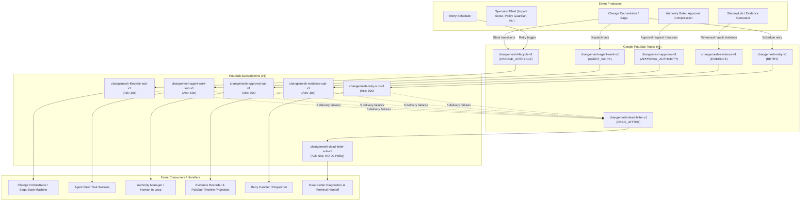

# ChangeMesh Pub/Sub Event Backbone Topology

**Schema Version:** `1.0.0`
**Canonical Topology Version:** `1.0.0`

## 1. Architectural Diagram

## 2. Topic and Subscription Matrix

| Topic ID | Logical Kind | Attached Subscription | Default Consumer | Dead Letter Target |
|---|---|---|---|---|
| `changemesh-lifecycle-v1` | `CHANGE_LIFECYCLE` | `changemesh-lifecycle-sub-v1` | Change Orchestrator / Saga | `changemesh-dead-letter-v1` (5 attempts) |
| `changemesh-agent-work-v1` | `AGENT_WORK` | `changemesh-agent-work-sub-v1` | Specialist Agent Fleet | `changemesh-dead-letter-v1` (5 attempts) |
| `changemesh-approval-v1` | `APPROVAL_AUTHORITY` | `changemesh-approval-sub-v1` | Authority Manager | `changemesh-dead-letter-v1` (5 attempts) |
| `changemesh-evidence-v1` | `EVIDENCE` | `changemesh-evidence-sub-v1` | Evidence Ledger & Timeline | `changemesh-dead-letter-v1` (5 attempts) |
| `changemesh-retry-v1` | `RETRY` | `changemesh-retry-sub-v1` | Retry Handler | `changemesh-dead-letter-v1` (5 attempts) |
| `changemesh-dead-letter-v1` | `DEAD_LETTER` | `changemesh-dead-letter-sub-v1` | Dead-Letter Diagnostics | *None (no cycle)* |

## 3. Canonical ChangeState Mapping

| ChangeState | Primary Topic | Secondary Topic | Role / Event Intent |
|---|---|---|---|
| `RECEIVED` | `changemesh-lifecycle-v1` | - | Initial change intake and validation |
| `DISCOVERING` | `changemesh-lifecycle-v1` | `changemesh-agent-work-v1` | Impact scout repository discovery dispatch |
| `QUALIFYING` | `changemesh-lifecycle-v1` | `changemesh-agent-work-v1` | Policy Guardian boundary qualification |
| `REHEARSING` | `changemesh-lifecycle-v1` | `changemesh-evidence-v1` | ShadowLab rehearsal twin execution |
| `GROUNDED` | `changemesh-lifecycle-v1` | - | Evidence grounded; autonomy policy evaluation |
| `AWAITING_AUTHORITY` | `changemesh-lifecycle-v1` | `changemesh-approval-v1` | Human authority escalation notification |
| `AUTHORIZED` | `changemesh-lifecycle-v1` | `changemesh-approval-v1` | Authority confirmed receipt |
| `EXECUTING` | `changemesh-lifecycle-v1` | `changemesh-agent-work-v1` | Release steward / migration engineer dispatch |
| `VERIFYING` | `changemesh-lifecycle-v1` | `changemesh-evidence-v1` | Post-execution verification suite |
| `CERTIFYING` | `changemesh-lifecycle-v1` | `changemesh-evidence-v1` | Evidence auditor blind semantic audit |
| `RETRY_SCHEDULED` | `changemesh-lifecycle-v1` | `changemesh-retry-v1` | Transient failure backoff dispatch |
| `COMPENSATING` | `changemesh-lifecycle-v1` | `changemesh-agent-work-v1` | Saga rollback / compensation execution |
| `BLOCKED` | `changemesh-lifecycle-v1` | `changemesh-evidence-v1` | Policy block terminal evidence |
| `COMPLETE` | `changemesh-lifecycle-v1` | `changemesh-evidence-v1` | Final completion and passport seal |
| `FAILED` | `changemesh-lifecycle-v1` | `changemesh-dead-letter-v1` | Terminal failure and dead-letter handoff |
| `CANCELLED` | `changemesh-lifecycle-v1` | - | Explicit cancellation transition |

## 4. Operational Invariants

1. **Non-Self-Applying:** Topology declarations in `events/topology.py` and `events/topology_manifest.json` do not mutate external cloud infrastructure at load time.
2. **Provider Neutrality:** All topology classes remain in `events/` and `domain/contracts/` with zero Google SDK dependencies.
3. **Dead-Letter Cycle Prohibition:** Subscriptions attached to the dead-letter topic MUST NOT specify a `dead_letter_policy`.
4. **Exhaustive State Coverage:** Every canonical `ChangeState` enum value has an explicit deterministic route in `lifecycle_routes`.
